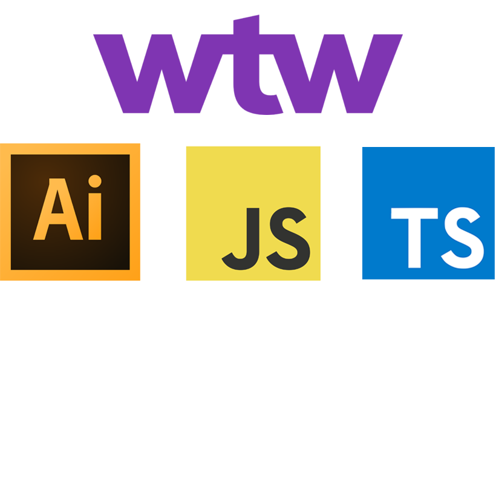

<!-- PROJECT LOGO -->
 

  

<h3 align="center">A Typescript file that converts into ECMA 3 target JS file for use in Adobe Illustrator 2022. JS script that automates icon export processes in Adobe Illustrator. More info TBC.</h3>

  

    Useful links 
     
    <a href="https://github.com/Artchibald/WTW_2022_icon_rebrand_scripts"><strong>Explore the docs »</strong></a>
     
     
    ·
    <a href="https://github.com/Artchibald/WTW_2022_icon_rebrand_scripts/issues">Report Bug</a>
    ·
    <a href="https://github.com/Artchibald/WTW_2022_icon_rebrand_scripts/issues">Request Feature</a>
        ·

  

# Ref for email comms

Subject >>>
WTW_55556_Software Product Icons

cc' >>>
 rrdcreativeldn@willistowerswatson.com

# WTW_2022_icon_rebrand_scripts

New stuff 

# Initial call brief

- 24/06/22
- 172 product icons.
- script with outputs
- transferred from old style brand to new style
- kick off monday
- call goes through style and icons
- new style outputted
- 7 outputs
- scale to colors to types of file
- also got versions already
- chris lead designer
- does conversion
- 172x
- old brand to new then approve
- type of files
- core / expressive
- 7 types of outputs
- various styles achieved
- not correct format but structure and sizing and line widht and colors is goood
- naming conventions
- see named swatches
- core is digi and expressive is for marketing annd press
- we had 2 dif. once, 
- target different artboards (by name)
- 2 artboards in same file
- 1 script vs two
- depending on icon categorisation internally
- infinity green is hr
- magenta is consumer
- guides: types of guides
- see grid
- we want rgb cmyk in dif colors
- 1 export is favicon.ico
- stripes: designer chooses which and direction

Initial inclination is a pop up with many options

# Discoveries

Font type must be TT (truetype), doesn't work with O (opentype)

# TUBS

- 2 hours amends Diane
- Friday 24 June 1 hour call and set up
- Sat 25 June 3 hours docs review, repo set up, set up typescript installation, remove all errors from original js script copy as TS
- Monday 27 June 8 hours, start script edits, convert to typescript without breaking, multiple tests, artboard division breakthrough, separate new file into 2 artboards, core & expressive. Move masthead over to position artboard 3 with JS maths. Lots of reading old script and ai script docs. Drew diagram of intended funcitonalty and passed onto team for review.
- Tue 28 June Reviewed and commented back on expectations spreadsheet. Read up on favicon.ico. Code bugs resolved: Hid guidelines layer before expots start, create expressive folder, move masthead down vertically, successfully add graphik font to script.

# No license for graphik font, delete on completion

# Shorten file names as per Jo request

# Add swatch to your swatches panel before starting with swtach .ai file. Swatch menu > Other Library...

