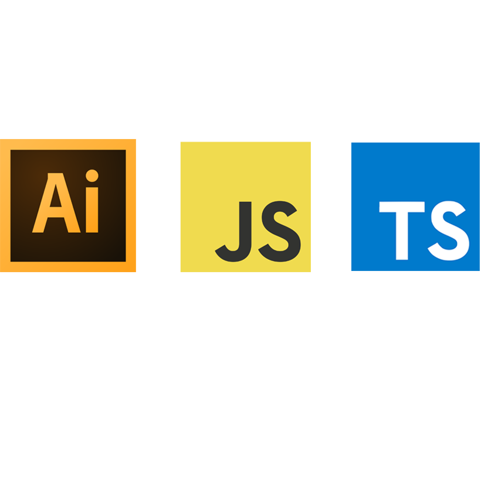

<!-- PROJECT LOGO -->
 

  

<h3 align="center">STILL WRITING THIS! A Typescript file that converts into ECMA 3 target JS file for use in Adobe Illustrator 2022. JS script that automates icon export processes in Adobe Illustrator. More info TBC.</h3>

  

    Useful links 
     
    <a href="https://github.com/Artchibald/2022_icon_rebrand_scripts"><strong>Explore the docs »</strong></a>
     
     
    ·
    <a href="https://github.com/Artchibald/2022_icon_rebrand_scripts/issues">Report Bug</a>
    ·
    <a href="https://github.com/Artchibald/2022_icon_rebrand_scripts/issues">Request Feature</a>
        ·

  

 

<!--# Ref for email comms

 Subject >>>
WTW_55556_Software Product Icons

cc' >>>
 rrdcreativeldn@willistowerswatson.com

# 2022_icon_rebrand_scripts -->

# Instructions

This script only works locally not on a server
I haven't finished writing this yet!  
Don't forget to change .txt to .js on the script.
FULL README (unfinished): https://github.com/Artchibald/2022_icon_rebrand_scripts 
I can take this pop up out if you prefer. 
Video set up tutorial available here: XXXTBCXXX 
Open a .ai template provided in folders called test.
Go to file > Scripts > Other Scripts > Import our new script.
You must have the folder called images in the parent folder, this is where wtw_logo.ai is saved so it can be imported into the big purple banner and exported as assets.
Illustrator says (not responding) on PC but it will respond, give Bill Gates some time XD !) 
If you run the script again, you should probably delete the previous assets created. They get intermixed and overwritten. 
Both artboard sizes must be exactly 256px x 256px. 
Guides must be on a layer called exactly 'Guidelines'. 
Icons must be on a layer called exactly 'Art'. 
Make sure all icons are unlocked to avoid bugs. 
Exported assets will be saved where the .ai file is saved. 
Please try to use underscore instead of spaces to avoid bugs in filenames. 
Any issues: archie@archibaldbutler.com.

# Initial call brief

- 24/06/22
- 172 product icons.
- script with outputs
- transferred from old style brand to new style
- kick off monday
- call goes through style and icons
- new style outputted
- 7 outputs
- scale to colors to types of file
- also got versions already
- chris lead designer
- does conversion
- 172x
- old brand to new then approve
- type of files
- core / expressive
- 7 types of outputs
- various styles achieved
- not correct format but structure and sizing and line widht and colors is goood
- naming conventions
- see named swatches
- core is digi and expressive is for marketing annd press
- we had 2 dif. once, 
- target different artboards (by name)
- 2 artboards in same file
- 1 script vs two
- depending on icon categorisation internally
- infinity green is hr
- magenta is consumer
- guides: types of guides
- see grid
- we want rgb cmyk in dif colors
- 1 export is favicon.ico
- stripes: designer chooses which and direction

Initial inclination is a pop up with many options

# Discoveries

Font type must be TT (truetype), doesn't work with O (opentype)

# TUBS

- 2 hours amends Diane
- Friday 24 June 1 hour call and set up
- Sat 25 June 3 hours docs review, repo set up, set up typescript installation, remove all errors from original js script copy as TS

ABOVE UNPAID!

- Monday 27 June 8 hours, start script edits, convert to typescript without breaking, multiple tests, artboard division breakthrough, separate new file into 2 artboards, core & expressive. Move masthead over to position artboard 3 with JS maths. Lots of reading old script and ai script docs. Drew diagram of intended funcitonalty and passed onto team for review.
- Tue 28 June Reviewed and commented back on expectations spreadsheet. Read up on favicon.ico. Code bugs resolved: Hid guidelines layer before expots start, create expressive folder, move masthead down vertically, successfully add graphik font to script.
- Wed 29 June, morning reorganise all exports into respective folders. Trying to fix RGB color bug.
- Thu 30 Continued debugging script, progress in spreadsheet required exports, discovered CMYK - RGB mismatch bug
- Fri 1 July continued debugging, call and present latest work, trying ot get SVG on white bg to export
- Mon 4 July Found fix for PNG exports on white bg but not SVG, tried to create a Typescript interface for debugging but not easy in ECMA 3 exports using AI API so parked it for now.
- Tue 5 July more tests on the SVG background white square, it is taking to long to restructure the layers but it is doable, so parked it. In the afternoon I fixed a big RGB color bug with Chris's help.
- Wed 6 colors no longer have to match exactly, script will not stop anymore if colors dont match. Uses the actual colors from the rebrand pdf in RGB and CMYK.
- Thu 7 troubles with the 4th artboard dimensions that need changing. Had some extensive debugging to stop the fourth artboard from cropping to the size of the text within. Got expressive banner debugged. Just needs aligning in mastDoc.
- Fri 8 new bug Michael Winter helped me with around clipping mask of Masthead eps export. Aligned MastDoc coordinates.
- Monday 11 July built out the last banner in the set 800x400 
- Tuesday 12 july , call with Chris new bug discovered trialing different icons, Call and present with Katie, started documentaiton
 - Wed 13 July working major blocker, icon h is not same as icon w, trialling solutions, no success
 - Thu 14 July Delivery day, finally fixed calculation from day before, packaged, cleaning, documenting
 - Fri 15 July Working on how ot crop for cropped pngs 16 and 24 requested by Katie, discussed with Chris McDemott and implementing new stage for this in the js file, also fixed CMYK issue major blocker 

<!-- # No license for graphik font, delete on completion -->

# Shorten file names as per Jo request

# Add swatch to your swatches panel before starting with swtach .ai file. Swatch menu > Other Library...

# New briefs from Katie

As mentioned, we wanted to explore potential options for exporting the expressive assets onto artboards with specific layouts.

Please see attached .ai file (social media and email sizes).

Basically – wondering if we can select a consistent X,Y coordinate and place that expressive icon there, with a dark ultraviolet background, and in the case of the social items – pre-populate the text of the application as well as the logo (assets attached here).

The text and the logo would also remain locked in a consistent location, and the expressive icon would be consistently cropped.

Please let me know if you’d like to discuss live. (Example below shows that expressive icon would be cropped – slightly). See email 28 June

# New action for pattern form Diane and Chris, see chat and discuss on call

# To do

- Create folders for all SVG, EPS, JPG,PNG and try to save them in the right place
- Find bug: One or more colors....
- Change svg dimensions?

# J

- let tasks: any = {}; line 83, better solution than any?
- Is there a way to edit the viewbox 256 settings in each svg?
- Convert to CMYK breaking script, not working colors undefined
- Inverse action works with old colors not new ones

# Notes from design brief call 29june

1 new brand graphic, magenta color panels
+ patterns

= perspective

2 iconology new style

if you are manipulating them, follow the pdf process

Graphic motif I use 100% STRIPE scaling(web)

 # Illustrator Edit > Assign profile > Must match sRGB IEC61966-2.1 or it won't work

 # Select each individual color shape and under Window > Colours make sure each shape color is set to rgb in burger menu or it won't work!

 # Presentation question them for folder structure

 # Blockers

 CMYK and RGB don't match this time round!

 SVG dimensions to be addressed

 # Issue with swatches stopping colors being RGB, trying  Edit > Edit colors > Convert to RGB

 - managed to fix with    // make sure all colors are RGB, equivalent of Edit > Colors > Convert to RGB
   app.executeMenuCommand('Colors9');

   do cropped 16 + 24
   documentation - reusability for other devs

